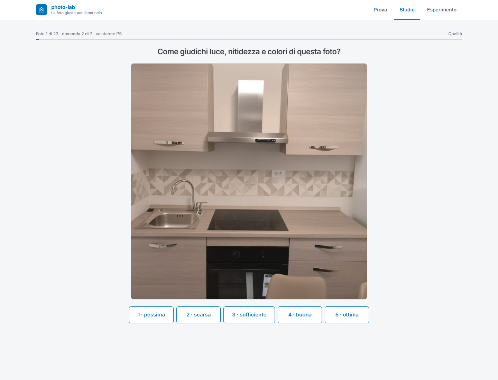
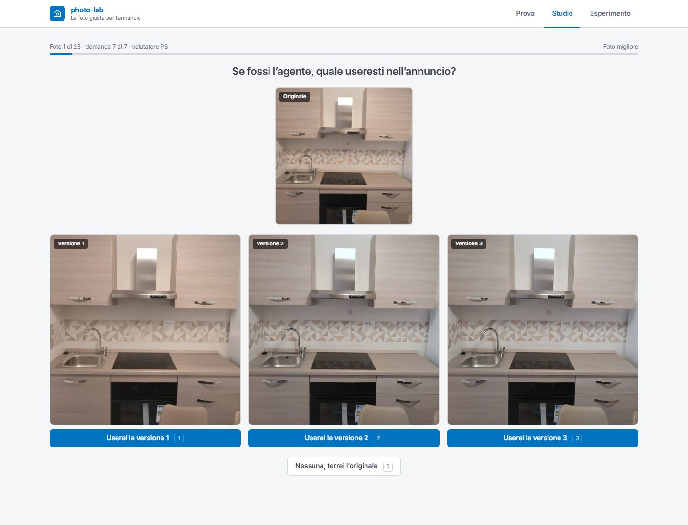

# immobiliare-photo-lab

Prototipo per il case study *Product Builder, Agentic AI Products* di Immobiliare.it.

- Prototipo online: https://immobiliare-photo-lab.vercel.app
- Nota di accompagnamento (2 pagine): `docs/report/immobiliare-photo-lab-nota.pdf`
- Architettura tecnica, workflow nodo per nodo: [`docs/architettura.md`](docs/architettura.md)

Questo README spiega come è costruito il prototipo: i tre flussi messi a confronto, i quattro
workflow n8n che li fanno girare, le tre viste del sito, come si misura e come si avvia. Il
perché delle scelte, i parametri di valutazione e il metodo di misura sono nella nota.

## Il problema in breve

Il caso d'uso è l'agente immobiliare che fotografa in fretta un immobile con il cellulare e
pubblica quelle foto così come sono. Il prodotto riceve le foto, riconosce i difetti tipici
dello scatto veloce (buia, controluce, colori falsati, rumore, inclinazione, compressione,
bassa risoluzione) e corregge soltanto quelli, un intervento per difetto. Non aggiunge, non
toglie e non ridisegna nulla: ogni correzione viene confrontata con l'originale da un controllo
di fedeltà deterministico e scartata se se ne allontana troppo.

## I tre flussi a confronto

Quello che si confronta non è come si corregge, ma chi decide cosa correggere. Le correzioni
sono le stesse per tutti (i moduli del workflow Correggi); cambia la diagnosi.

- **D1, regole.** Nessun modello: luminosità, dominante di colore, rumore e linee inclinate
  vengono misurati e regole scritte a mano scelgono i moduli e i valori.
- **D2, modello con verifica.** Claude Haiku riceve la foto e le stesse misure, indica i difetti
  e i valori; dopo la correzione riguarda il risultato accanto all'originale e, se non lo
  convince, corregge il proprio piano. Alcune guardie deterministiche (inclinazione misurata,
  verso dell'esposizione, prudenza su foto compresse) possono modificare il piano del modello
  e vengono contate.
- **D3, generativo.** SDXL con ControlNet riceve la foto e un prompt da fotografo e restituisce
  una nuova immagine della stessa stanza; passa dallo stesso controllo di fedeltà.

## I quattro workflow n8n

I workflow sono generati da `n8n/build_workflows.py` (i prompt vengono da `prompts/`, gli
indirizzi da `.env`): i JSON in `n8n/` non si modificano a mano. Le chiamate ai modelli
partono tutte da n8n, così nessuna chiave arriva mai al browser.

### Correggi, il motore delle correzioni


È un sotto-workflow: riceve una foto e un piano (quali moduli, con quali valori) e applica un
intervento alla volta in sei corsie: Risoluzione (Real-ESRGAN, solo sotto i 1000 px ed
etichettata), Colore, Luce, Pulizia, Raddrizza, Nitidezza. Ogni corsia gira solo se il piano
la chiede, applica il proprio parametro sopra quelli già accettati ripartendo dall'originale e
passa dal controllo di fedeltà: se il risultato è troppo diverso dall'originale, un tentativo
più prudente, poi la corsia viene saltata. Alla fine i parametri accettati vengono applicati
insieme. Prodotto e Batch usano lo stesso Correggi: è il modo per confrontare solo la diagnosi.

### Prodotto, chiamato dal sito


Il webhook riceve la foto dalla vista Prova, la misura (`/prepare` di cv-service) e risponde
subito con un `image_id`, perché il generativo a freddo può impiegare due minuti e un webhook
non resta aperto tanto. Poi manda la foto in parallelo alle tre corsie: D1 e D2 costruiscono il
piano e chiamano Correggi; D3 chiama il modello generativo su Replicate, aspetta con un ciclo
di polling e applica lo stesso controllo di fedeltà. Il record con le tre versioni, i difetti
trovati, i moduli eseguiti, la fedeltà, il costo e il tempo viene salvato in
`experiments/runs/`; il sito lo recupera interrogando `photo-lab-result`.

### Scelte, i webhook di servizio


Quattro webhook piccoli: registra una risposta dello Studio (`photo-lab-choice`), serve il
tabellone (`photo-lab-summary`), serve il risultato di un'esecuzione (`photo-lab-result`) e la
lista delle foto dello studio (`photo-lab-study`). Ognuno passa la mano a cv-service.

### Batch, l'esperimento sul dataset


Ripete il lavoro di Prodotto su un intero insieme di foto (le 24 del dataset, o gli id indicati
in `Config`), una alla volta, con le stesse corsie e lo stesso Correggi. È il modo in cui sono
state preparate le tre versioni di ogni foto dello Studio. Un giudice automatico (Claude
Sonnet) è previsto come opzione ma spento: i giudizi che contano sono quelli delle persone.

## Il sito

Tre viste, un solo backend (i webhook n8n). Se il backend non risponde, Studio ed Esperimento
leggono una copia statica in `frontend/public/snapshot/`.

### Prova, il prodotto


Si carica una foto scattata col telefono; dopo circa un minuto arrivano le tre versioni
affiancate. Su ogni immagine una maniglia prima/dopo; sotto, la scheda del metodo: come decide,
cosa ha visto (i difetti trovati e la spiegazione del modello), cosa ha fatto (i moduli
eseguiti con i valori; per il generativo, le differenze misurate dopo sui pixel) e il tempo di
elaborazione. Qui non si sceglie: la preferenza si misura nello Studio.

### Studio, il test cieco


Per ogni foto del dataset il valutatore risponde a tre domande, senza sapere quale flusso ha
prodotto cosa. Realismo: originale accanto a una versione, "vedi elementi finti, generati o
strutturalmente diversi?" (sì/no). Qualità: la sola versione, voto da 1 a 5 su luce, nitidezza
e colori. Foto migliore: originale in alto e le tre versioni affiancate, "se fossi l'agente,
quale useresti?". Sette risposte per foto, tastiera o mouse; si può interrompere e riprendere
dallo stesso punto con le proprie iniziali. Ogni risposta finisce in `experiments/judgments.csv`.





### Esperimento, il tabellone


Ricalcolato a ogni apertura dai record e dalle risposte raccolte. Le quattro misure del test
cieco per ogni flusso: tasso di alterazione (realismo), voto medio (qualità), quota di vittorie
con intervallo di confidenza al 95% (foto migliore) e tasso di pubblicabilità (output efficace:
voto almeno 4 e nessuna alterazione, dallo stesso valutatore). La regola di decisione è fissata
prima di guardare i dati: fuori chi supera il 10% di correzioni fermate dal controllo di
fedeltà, di errori o di alterazioni segnalate; tra gli ammessi vince la foto migliore con almeno
trenta giudizi; a parità statistica decide il costo per foto.

## Cosa è reale e cosa è simulato

Nel prototipo non c'è nulla di simulato: le chiamate ai modelli, i tempi, i costi tracciati, il
controllo di fedeltà e le 24 foto (immobili veri, da annunci pubblici) sono reali. La
sperimentazione con il panel di valutatori non è stata eseguita: il prototipo la rende
possibile e la nota descrive cosa misurerebbe e come deciderebbe.

## Strumenti

- **n8n** self-hosted (Docker, VPS Hostinger): i quattro workflow, tutte le chiamate ai modelli.
- **Claude Haiku 4.5** (API Anthropic) per diagnosi e verifica di D2; **SDXL + ControlNet** e
  **Real-ESRGAN** tramite **Replicate** per D3 e la super-risoluzione.
- **Python 3.12, FastAPI, OpenCV**: `cv-service`, tutto ciò che è deterministico (correzioni,
  controllo di fedeltà, dataset, record, tabellone). Trentacinque test con `pytest`.
- **React 19, Vite, TypeScript, Tailwind 4**: il sito, pubblicato su **Vercel**.
- **Claude Code** come strumento di supporto allo sviluppo; **GitHub** per codice e storia.

## Struttura del repository

```
cv-service/   servizio Python: pipeline di correzione, controllo di fedeltà, dataset, record,
              giudizi, tabellone (api/experiment.py)
n8n/          i quattro workflow (JSON generati), lo script che li genera, gli screenshot
frontend/     sito React: Prova, Studio, Esperimento; copia statica in public/snapshot/
prompts/      prompt del modello vision (diagnosi e verifica) e del giudice automatico
dataset/      le 24 foto con le etichette manuali dei difetti (labels.csv)
experiments/  record delle esecuzioni (runs/), lista dello studio, calibrazione del controllo
              di fedeltà, script di esportazione della copia statica
docs/         contratto dati, calibrazione del controllo di fedeltà, sorgente della nota
deploy/       docker-compose e script di aggiornamento del server
```

## Dove gira

- Sito su Vercel: https://immobiliare-photo-lab.vercel.app (ogni push su `main` lo ricostruisce).
- n8n self-hosted su un VPS Hostinger (Docker), in https.
- cv-service sullo stesso VPS come container, sulla rete interna di n8n
  (`deploy/docker-compose.yml`), con `dataset/` ed `experiments/` montati dal repository clonato
  in `/opt/photo-lab`. Aggiornamento con `bash deploy/update.sh` (allinea il clone a
  `origin/main`, rebuild, riavvio, controllo di salute). Le risposte dello Studio si accumulano
  sul server in `experiments/judgments.csv`, fuori da git.

## Come si avvia

Serve Python 3.12, Node 20 o superiore, un'istanza n8n (self-hosted con Docker oppure n8n
Cloud), una chiave API Anthropic e un token Replicate. Le chiavi vanno in `.env`, ignorato da
git; `.env.example` elenca le variabili.

### Sul server (come è pubblicato)

Sul VPS con il template n8n di Hostinger, da root:

```bash
git clone https://github.com/Pio57/immobiliare-photo-lab.git /opt/photo-lab
cd /opt/photo-lab
docker compose -f deploy/docker-compose.yml up -d --build
docker exec <container n8n> wget -qO- http://cv-service:8000/health   # {"status":"ok"}
```

In `.env` locale si mette `CV_SERVICE_PUBLIC_URL=http://cv-service:8000`, si rigenerano i workflow
e si importano nel n8n del server seguendo `n8n/README.md` (Correggi per primo, il suo
identificativo in `.env` come `N8N_CORRECT_WORKFLOW_ID`, poi Prodotto e Scelte, credenziali sui
nodi, Publish). Su Vercel si imposta `VITE_N8N_WEBHOOK_URL` con l'URL del webhook del prodotto.

### In locale (sviluppo)

1. Copiare `.env.example` in `.env` e inserire le chiavi.
2. Avviare il servizio:
   ```powershell
   cd cv-service
   py -3.12 -m venv .venv
   .venv\Scripts\activate
   pip install -r requirements.txt
   pytest
   uvicorn app.main:app --port 8000
   ```
3. Esporlo con `ngrok http 8000` e copiare l'indirizzo pubblico in `.env` come
   `CV_SERVICE_PUBLIC_URL`.
4. Generare i workflow con `cv-service\.venv\Scripts\python.exe n8n\build_workflows.py` e
   importarli in n8n come sopra.
5. Copiare l'indirizzo del webhook del prodotto in `.env` come `VITE_N8N_WEBHOOK_URL`.
6. Avviare il sito: `cd frontend`, `npm install`, `npm run dev`, e aprire `http://localhost:5173`.

A ogni riavvio di ngrok l'indirizzo cambia: aggiornare `.env`, rigenerare i workflow e
reimportarli. La copia statica del sito si rigenera con
`experiments/scripts/export_snapshot.py` a cv-service acceso.
