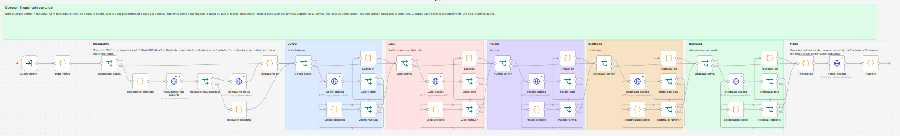
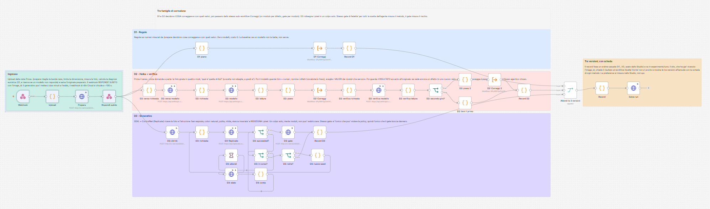
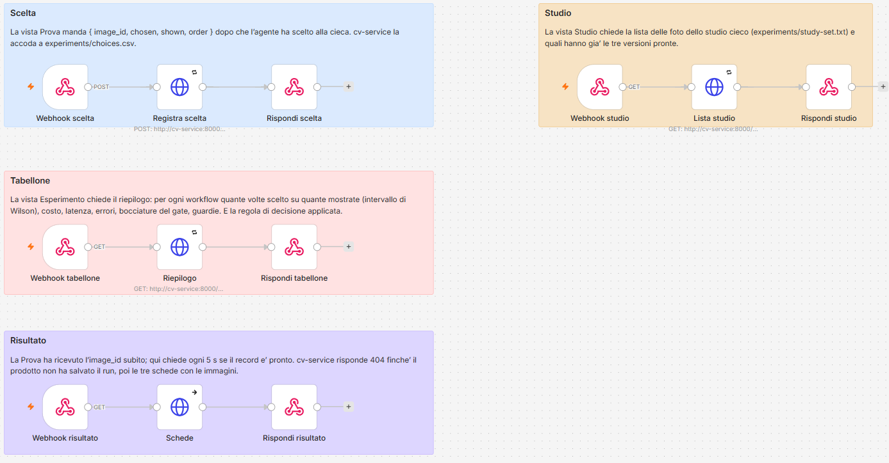
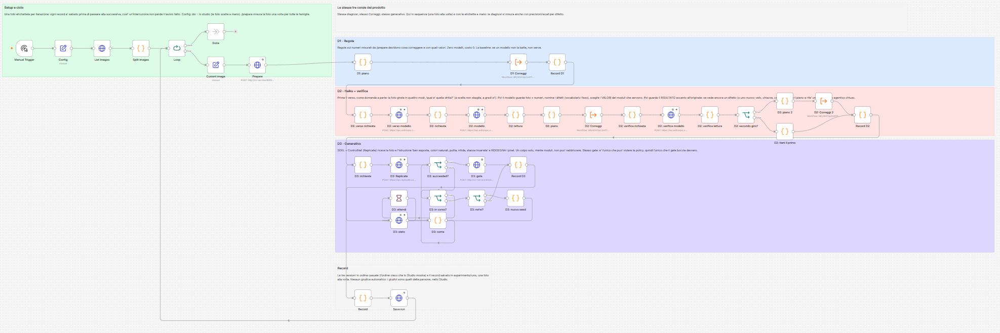
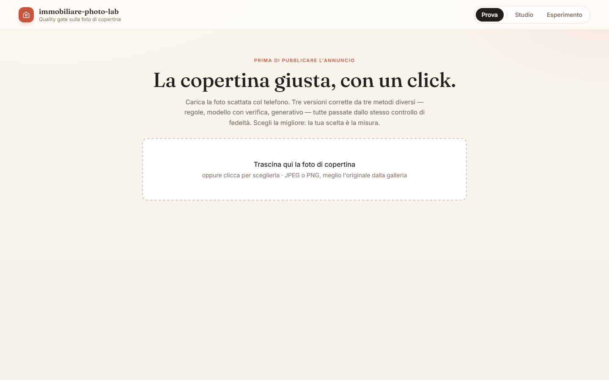
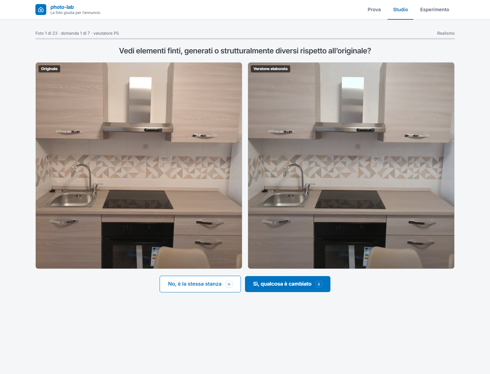
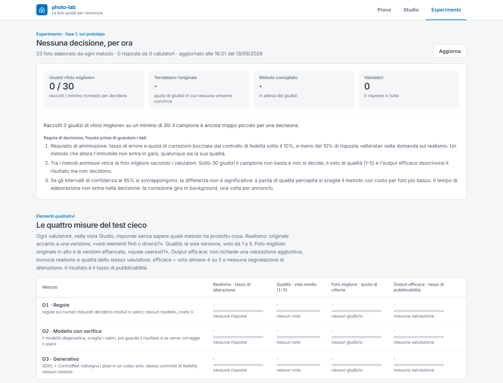

# Architettura tecnica

Questo documento accompagna la nota e il README: descrive come è costruito il prototipo, componente
per componente e nodo per nodo, per chi vuole leggerlo o riprodurlo. Il perché delle scelte di
prodotto è nella nota (`docs/report/nota.md`); qui c'è il come.

## 1. Vista d'insieme

Tre parti, tre responsabilità:

```
 browser (React, Vercel)
     │  HTTPS, solo webhook
     ▼
 n8n self-hosted (VPS Hostinger, Docker)          ┐ orchestrazione: quattro workflow,
     │  rete interna Docker                        │ tutte le chiamate ai modelli,
     ▼                                             ┘ le chiavi API
 cv-service (Python, FastAPI, OpenCV, Docker)     ┐ tutto ciò che è deterministico:
     │  filesystem del repository clonato          │ correzioni, controllo di fedeltà,
     ▼                                             ┘ dataset, record, giudizi, tabellone
 dataset/  experiments/  frontend/public/snapshot/
```

Il sito non conosce nessuna chiave e non parla mai con i modelli: chiama i webhook di n8n. n8n
chiama Anthropic (Claude Haiku 4.5) e Replicate (SDXL + ControlNet, Real-ESRGAN) con le
credenziali salvate nella propria istanza, e chiama cv-service sulla rete interna
(`http://cv-service:8000`, mai esposto su internet). cv-service legge e scrive sul repository
clonato sul server: i record delle esecuzioni in `experiments/runs/`, le risposte dello Studio in
`experiments/judgments.csv`, le immagini prodotte in `dataset/processed/`.

Un solo vincolo di progetto attraversa tutto: le correzioni ammesse sono quelle per cui esiste
un parametro in `EnhanceParams` (`cv-service/app/schemas.py`, `docs/contracts.md`). Un modello
non può chiedere di sostituire un cielo o togliere un oggetto perché non esiste il parametro; il
solo flusso che tocca i pixel liberamente, il generativo, passa dallo stesso controllo di
fedeltà degli altri.

## 2. I tre flussi

Quello che si confronta è chi decide cosa correggere. Le correzioni le esegue sempre lo stesso
sotto-workflow (Correggi), così la differenza misurata è solo nella diagnosi.

- **D1, regole.** `POST /prepare` misura la foto (luminanza media, deviazione standard,
  dominante di colore, rumore stimato, inclinazione delle linee verticali, avvisi su compressione
  e risoluzione) e `auto_params` traduce le misure in parametri con regole fisse. Nessuna
  chiamata a modelli.
- **D2, modello con verifica.** Claude Haiku riceve la foto e le stesse misure, restituisce un
  JSON con difetti (vocabolario chiuso), `exposure` in stop, `white_balance`, `clahe_clip`,
  `denoise`, `rotate_deg`, `sharpen`, `recommendation`. Il nodo Piano converte e applica le
  guardie deterministiche (sotto). Dopo Correggi, il modello rivede originale e risultato
  affiancati: se risponde `adjust` con un nuovo piano, Correggi gira una seconda volta.
- **D3, generativo.** SDXL + ControlNet (canny) su Replicate in modalità img2img,
  `strength 0.35`, prompt "the same room, real estate listing photo, well exposed, natural white
  balance, no noise, sharp and clean, realistic, unchanged furniture, walls and layout", seed
  fisso. Nessuna diagnosi, nessun modulo: l'immagine torna a cv-service, che la confronta con
  l'originale e misura a posteriori cosa è cambiato.

### Le guardie deterministiche sul piano del modello (`plan_js`)

Il piano di D2 passa da quattro correzioni automatiche prima di arrivare a Correggi, ognuna
registrata in `plan_fixes` e contata nel tabellone:

1. se il rilevatore di linee ha misurato un'inclinazione, quel valore sostituisce il
   `rotate_deg` del modello (un modello di visione capisce "pende a sinistra", il segno
   dell'angolo molto meno, e il gate non può accorgersi di un verso sbagliato perché allinea
   l'originale prima di confrontare);
2. se il piano scurisce una foto buia o schiarisce una foto chiara, la gamma viene invertita
   (errore di segno, non di giudizio);
3. su input compresso `clahe_clip` va a 0 e `sharpen` a non più di 0,2 (il contrasto locale
   amplifica i blocchi JPEG sui muri piatti);
4. `exposure` in stop diventa `gamma = 2^(−exposure/2)`: il modello ragiona in "più chiara di
   uno stop", non in gamma, che i modelli invertono di frequente;
5. se l'inclinazione misurata supera i 17°, nessuna rotazione (il ritaglio necessario butterebbe
   via troppa foto): il piano azzera `rotate_deg`, segna il difetto `tilt` e aggiunge il consiglio
   `reshoot`. Vale anche per le regole (D1).

Se il modello non risponde o il JSON non è leggibile, il piano ricade su quello delle regole e
la versione viene marcata `error` con `source: heuristic`: l'agente riceve comunque una foto.

## 3. I workflow n8n, nodo per nodo

I quattro workflow sono generati da `n8n/build_workflows.py`: i prompt vengono da
`prompts/diagnosis.md` (sezioni System, User, Review), gli indirizzi da
`.env`. Le sticky note sul canvas sono generate anch'esse e descrivono ogni corsia. Le
convenzioni: i nodi Code girano "una volta per item"; i nodi HTTP verso cv-service hanno timeout
180 s e fino a 8 tentativi a 15 s di distanza; i nodi verso Anthropic nel prodotto hanno
`onError: continue`, così un errore del modello non ferma il flusso ma diventa una ricaduta sulle
regole.

### 3.1 Correggi (`workflow-correct.json`, 50 nodi, sotto-workflow)



Riceve `{ input: { image_b64, image_id?, low_resolution }, plan, save_as }` e restituisce
`{ output_b64, output_path, params, fidelity, crop_pct, steps, applied, changed, ai_reconstructed }`.

| nodo | tipo | cosa fa |
|---|---|---|
| Da chi chiama | Execute Workflow Trigger | riceve l'item dal chiamante (Prodotto o Batch) |
| Stato iniziale | Code | costruisce lo stato che attraversa le corsie: `plan` completato con i valori neutri, `accepted` (parametri accettati finora, all'inizio solo `recommendation`), `steps` (sei righe, una per modulo), `retry` |

Poi sei corsie. La prima, **Risoluzione**, è l'unica generativa e parte solo se
`input.low_resolution` è vero (lato lungo sotto 1000 px):

| nodo | tipo | cosa fa |
|---|---|---|
| Risoluzione: serve? | IF | `input.low_resolution === true` |
| Risoluzione: richiesta | Code | corpo per Replicate: Real-ESRGAN ×2, `face_enhance: false`, immagine inline o URL del dataset |
| Risoluzione: Real-ESRGAN | HTTP | `POST api.replicate.com/v1/predictions` con `Prefer: wait=60` |
| Risoluzione: succeeded? | IF | `status === 'succeeded'` |
| Risoluzione: ricevi | HTTP | `POST cv-service/gate_remote`: scarica l'output, lo confronta con l'input, restituisce immagine e fedeltà |
| Risoluzione: ok | Code | l'immagine ingrandita diventa l'input dei moduli successivi; `ai_reconstructed = true`; il piano viene adattato (`denoise → 0`, `clahe_clip ≤ 1`, `sharpen ≤ 0,2`, perché la foto ingrandita è già liscia) e l'adattamento registrato in `plan_adjusted` |
| Risoluzione: saltata | Code | Replicate ha fallito: si prosegue con la foto com'è, `steps[0]` registra l'errore |

Le cinque corsie deterministiche (**Colore**, **Luce**, **Pulizia**, **Raddrizza**,
**Nitidezza**) hanno tutte la stessa forma, sei nodi ciascuna:

| nodo | tipo | cosa fa |
|---|---|---|
| *Modulo*: serve? | IF | il piano chiede questo modulo? (`white_balance > 0`; `gamma !== 1 || clahe_clip > 0`; `denoise > 0`; `rotate_deg !== 0`; `sharpen > 0`) |
| *Modulo*: applica | HTTP | `POST cv-service/apply` con `params = accepted + {parametro del modulo}`: si riparte sempre dall'originale e si applicano insieme i parametri già accettati più il candidato |
| *Modulo*: gate | IF | `fidelity.passed` |
| *Modulo*: ok | Code | il parametro pianificato entra in `accepted`; la riga di `steps` registra `applied: true`, la fedeltà e i valori |
| *Modulo*: bocciata | Code | prima volta: prende i `suggested_conservative_params` che cv-service restituisce, li mette nel piano, segna `retried` e alza `_again`; seconda volta: `applied: false, passed: false`, il modulo viene saltato e la foto resta com'era al passo precedente |
| *Modulo*: riprova? | IF | `_again` → torna ad *applica*, altrimenti passa alla corsia successiva |

L'ordine delle corsie è l'ordine della pipeline di cv-service (bilanciamento del bianco prima
della curva tonale, pulizia dopo, rotazione, nitidezza per ultima). Chiusura:

| nodo | tipo | cosa fa |
|---|---|---|
| Finale: stato | Code | raccoglie lo stato dall'ultima corsia percorsa |
| Finale: applica | HTTP | `POST cv-service/apply` con tutti gli `accepted`, `return_image: true`, `save_as` per scrivere il file in `dataset/processed/` |
| Risultato | Code | l'oggetto restituito al chiamante: immagine, parametri, fedeltà, `crop_pct`, le sei righe di `steps`, `applied`, `changed` |

Una foto solo storta passa quindi da un solo nodo *applica* (Raddrizza) più il finale; una foto
senza difetti non chiama nulla e torna `changed: false`.

### 3.2 Prodotto (`workflow-product.json`, 45 nodi, webhook `photo-lab-product`)



| nodo | tipo | cosa fa |
|---|---|---|
| Webhook | Webhook | `POST /photo-lab-product`, multipart con il campo `image`, CORS aperto |
| Upload | Code | legge il binario e lo passa in base64 |
| Prepara | HTTP | `POST cv-service/prepare`: taglia le bande uniformi ai bordi, limita il lato lungo a 1600 px, misura, calcola parametri e difetti euristici (D1), salva l'originale preparato come `live_<t>_orig.jpg` |
| Rispondi subito | Respond to Webhook | `{ accepted: true, image_id }`: il browser riceve subito l'identificativo e inizia a interrogare `photo-lab-result` ogni 5 s. Necessario perché il generativo a freddo può superare i due minuti, oltre la durata di un webhook |

Da qui tre corsie in parallelo.

**Corsia D1** (2 nodi + Correggi): `D1: piano` (Code, `plan_js` con la diagnosi euristica di
Prepara) → `D1: Correggi` (Execute Workflow, attende il sotto-workflow) → `Record D1` (Code,
costruisce il `VariantResult`).

**Corsia D2** (16 nodi):

| nodo | tipo | cosa fa |
|---|---|---|
| D2: quattro versi | HTTP | `POST cv-service/turns`: la foto girata di 0, 90, 180, 270 gradi, in miniatura |
| D2: verso richiesta | Code | la domanda al modello: quattro immagini, "qual è quella dritta?", una lettera di risposta |
| D2: verso modello | HTTP | chiamata ad Anthropic (circa 1.100 token, 1,5 s) |
| D2: verso lettura | Code | lettera → quarto di giro (`orientation`); posta come scelta il modello non sbaglia (16/16 sul banco), come angolo sbaglia direzione una volta su due |
| D2: richiesta | Code | corpo per Anthropic: system e user da `prompts/diagnosis.md`, foto in base64, misure di Prepara in JSON, `max_tokens 600`, thinking disabilitato |
| D2: modello | HTTP | `POST api.anthropic.com/v1/messages`, credenziale `anthropicApi` di n8n |
| D2: lettura | Code | `parse_js`: estrae il JSON dalla risposta, calcola il costo dai token a prezzo di listino, converte `exposure` in gamma; risposta illeggibile → `error` e piano nullo |
| D2: piano | Code | `plan_js`: piano del modello se c'è, altrimenti riserva sulle regole; applica le guardie; l'orientamento viene dalla domanda a quattro vie, non dalla diagnosi |
| D2: Correggi | Execute Workflow | prima correzione |
| D2: verifica richiesta | Code | corpo della verifica: ORIGINAL e CORRECTED come immagini, il piano e le righe dei moduli eseguiti, prompt Review |
| D2: verifica modello | HTTP | seconda chiamata ad Anthropic |
| D2: verifica lettura | Code | stesso parser; `verdict` `ok` o `adjust` con un nuovo piano |
| D2: secondo giro? | IF | `verdict === 'adjust' && plan !== null` |
| D2: piano 2 | Code | nuovo piano con le stesse guardie |
| D2: Correggi 2 | Execute Workflow | seconda correzione |
| D2: tieni il primo | Code | verdetto `ok`: il risultato della prima correzione passa avanti |
| Record D2 | Code | `VariantResult` con `iterations` 1 o 2, costo e latenza sommati sui due giri, `review_verdict` |

**Corsia D3** (10 nodi):

| nodo | tipo | cosa fa |
|---|---|---|
| D3: shrink | HTTP | `POST cv-service/prepare` con `max_side 1024`: Replicate accetta immagini inline fino a circa 256 KB; il modello lavora sulla copia ridotta, il gate sull'originale pieno |
| D3: richiesta | Code | corpo per Replicate: versione del modello, prompt e negative prompt, `img2img`, `strength 0.35`, `condition_scale 1.1`, `guidance_scale 5`, 30 passi, seed 42 |
| D3: Replicate | HTTP | `POST api.replicate.com/v1/predictions` con `Prefer: wait=60`, credenziale header `Authorization: Bearer` |
| D3: succeeded? | IF | `status === 'succeeded'` |
| D3: in corso? | IF | `starting` o `processing` e meno di 12 tentativi |
| D3: attendi | Wait | 15 secondi |
| D3: stato | HTTP | `GET urls.get` della prediction |
| D3: conta | Code | incrementa `_polls` e torna a *succeeded?* (il ciclo di polling del cold start, fino a 3 minuti) |
| D3: nsfw? / D3: nuovo seed | IF / Code | il filtro di sicurezza del modello scatta a vuoto su letti e vestiti ("NSFW content detected") e un 429 arriva con due upload insieme: fino a due nuovi tentativi con un altro seed, poi errore |
| D3: gate | HTTP | `POST cv-service/gate_remote`: scarica l'output, lo confronta con l'originale, lo salva come `<id>_D3.jpg`, restituisce fedeltà e `measured_changes` |
| Record D3 | Code | `VariantResult` senza diagnosi: costo dal `predict_time` a tariffa GPU, sei righe di `steps` ricavate dalle misure a posteriori (una riga è `applied` quando la variazione misurata supera quella di una semplice ricodifica), `status` `accepted`, `rejected_fidelity`, `timeout` o `error` |

Chiusura:

| nodo | tipo | cosa fa |
|---|---|---|
| Attendi le 3 versioni | Merge (3 ingressi) | aspetta i tre Record |
| Record | Code | il record dell'esecuzione: `image_id`, `source: live`, le tre `variants` senza i pixel, un `order` casuale (l'ordine cieco usato dalle schede), avvisi sull'input, difetti euristici, latenza totale |
| Salva run | HTTP | `POST cv-service/runs/<image_id>`: scrive `experiments/runs/<id>.json` |

### 3.3 Scelte (`workflow-choice.json`, 16 nodi, quattro webhook)



Quattro catene identiche di tre nodi (Webhook → HTTP verso cv-service → Respond to Webhook),
con CORS aperto:

| webhook | metodo | cv-service | serve a |
|---|---|---|---|
| `photo-lab-choice` | POST | `POST /choices` | una risposta dello Studio (`task` realism, quality o best) |
| `photo-lab-summary` | GET | `GET /summary` | il tabellone della vista Esperimento |
| `photo-lab-result` | GET | `GET /runs/{image_id}/cards` | le tre versioni di un'esecuzione, per la Prova (polling) e per lo Studio |
| `photo-lab-study` | GET | `GET /study` | gli id dello studio, quali sono pronti, i valutatori finora |

### 3.4 Batch (`workflow-batch.json`, 47 nodi, avvio manuale)



Le stesse corsie del Prodotto, in sequenza anziché in parallelo, dentro un ciclo sulle foto del
dataset:

| nodo | tipo | cosa fa |
|---|---|---|
| Manual Trigger | Trigger | avvio a mano dal canvas |
| Config | Set | `cv_url`, `limit`, `skip_done`, `ids` (vuoto = tutto il dataset, altrimenti gli id dello studio) |
| List images | HTTP | `GET cv-service/dataset` |
| Split images | Code | un item per foto, filtrati da `Config.ids` |
| Loop | Split in Batches | una foto alla volta; all'uscita `Done` |
| Current image | Set | l'id corrente |
| Prepara | HTTP | come nel Prodotto, ma dalla foto del dataset |
| D1 → Record D1 → D2 … → Record D2 → D3 … → Record D3 | | le corsie del Prodotto, concatenate: ogni Record aggiunge la propria versione a quelle precedenti |
| Record | Code | il record della foto: le tre versioni in ordine casuale (l'ordine cieco dello Studio), `source: batch` |
| Save run | HTTP | `POST cv-service/runs/<image_id>` e ritorno al Loop |

Nel batch le immagini raggiungono i modelli per URL del dataset (`GET cv-service/dataset/<id>/file`)
invece che inline. Nessun giudice automatico: i giudizi sono quelli delle persone, nello Studio.

## 4. cv-service

FastAPI, Python 3.12, OpenCV. Trentacinque test (`pytest`). Configurazione in `app/config.py`
(`max_side 1600`, `jpeg_quality 90`, `REPO_ROOT` sovrascrivibile: sul server è `/data`).

### 4.1 Endpoint

| endpoint | usato da | cosa fa |
|---|---|---|
| `GET /health` | deploy | stato |
| `POST /prepare` | Prodotto, Batch, D3 shrink | ridimensiona, taglia le bande, misura (`ImageStats`), calcola `heuristic_params` e `heuristic_defects`, opzionalmente salva |
| `POST /apply` | Correggi | applica `EnhanceParams` all'immagine, esegue il controllo di fedeltà contro l'originale allineato, restituisce immagine (se richiesta), parametri effettivi, `fidelity`, `crop_pct` e, se bocciata, `suggested_conservative_params` |
| `POST /gate_remote` | D3, Risoluzione | scarica un'immagine da URL, la confronta con l'originale, la salva, restituisce `fidelity` e `measured_changes` |
| `POST /runs/{id}` | Prodotto, Batch | salva il record; i pixel eventualmente inline vengono scritti in `dataset/processed/` e tolti dal JSON |
| `GET /runs/{id}/cards` | Scelte | le schede di un'esecuzione nell'ordine cieco del record, con le immagini in base64; se `dataset/processed/` manca (server appena clonato) le immagini vengono dalla copia statica del sito |
| `GET /dataset`, `/dataset/{id}`, `/dataset/{id}/file`, `/processed/{name}` | Batch, modelli | il dataset e le immagini prodotte |
| `POST /choices` | Scelte | accoda una riga a `experiments/judgments.csv`; valida `task` e `answer` |
| `GET /study` | Scelte | id di `experiments/study-set.txt`, quali hanno un record, risposte per valutatore |
| `GET /summary` | Scelte | il tabellone (sotto) |

### 4.2 La pipeline (`app/core/pipeline.py`)

`apply(img, params)` esegue, nell'ordine: bilanciamento del bianco gray-world pesato da
`white_balance`; livelli automatici (nero al percentile 0,5) e gamma; CLAHE con `clahe_clip`;
denoise non-local means con forza `denoise` scalata sulla risoluzione; rotazione di `rotate_deg`
con ritaglio al rettangolo pieno (il `crop_pct` viene riportato); maschera di contrasto con
`sharpen`, preceduti da `turn` (quarto di giro senza perdita, `orientation`). `analyze` produce le misure; `estimate_tilt` usa le linee verticali (Canny + Hough), con le
orizzontali solo come riserva a consenso stretto, e con linee da un lato solo accetta soltanto
inclinazioni fino a 3° (una prospettiva non è una rotazione); se non trova nulla chiede una seconda
opinione ai segmenti più lunghi (LSD, che segue anche spigoli a basso contrasto): se, tolti due
valori anomali, pendono tutti dalla stessa parte di almeno 3° e concordano entro 8°, quella è la
rotazione, fino a 15° (ritaglio del 36%); oltre i 17° viene riportata ma non applicata. `auto_params` sono le regole di D1:
su input compresso spegne CLAHE, alza il denoise e limita la nitidezza.

### 4.3 Il controllo di fedeltà (`app/core/metrics.py`)

Due misure, calibrate sul dataset (`docs/gate-calibration.md`, `experiments/scripts/calibrate_gate.py`):

- **struttura**: correlazione normalizzata per blocchi di 32 px sulla luminanza sfocata; invariante
  alle trasformazioni affini locali dell'intensità, che è ciò che fanno gamma, CLAHE e bilanciamento
  del bianco. Si usano il decimo percentile (`structure`) e il blocco peggiore (`structure_local_min`);
- **tonalità**: correlazione degli istogrammi di hue dopo normalizzazione gray-world di entrambe le
  immagini, per intercettare sostituzioni di colore estese.

`score = 0,7·structure + 0,3·hue_corr`; passa se `score ≥ 0,90` e `structure_local_min ≥ 0,65`.
Per i moduli il confronto è con l'originale ruotato della stessa quantità; per il generativo è
diretto. Sul banco di calibrazione le 50 correzioni lecite passano tutte, e delle 100 vietate
(oggetto rimosso, finestra sostituita, crepa riparata, smear generativo) ne passano 7, tutte crepe
sottili. Per questo la super-risoluzione, che inventa texture sotto la scala del gate, è ammessa
solo sotto i 1000 px e sempre etichettata `ai_reconstructed`.

### 4.4 Il tabellone (`app/api/experiment.py`)

`GET /summary` rilegge a ogni chiamata i record delle foto dello studio e `judgments.csv` e calcola,
per flusso: tasso di alterazione (risposte «sì» al realismo, con intervallo di Wilson al 95%);
voto medio di qualità e deviazione; quota di vittorie in «foto migliore» (vittorie / apparizioni,
con intervallo di Wilson); tasso di pubblicabilità (per ogni coppia valutatore-versione, voto ≥ 4 e
nessuna alterazione); e i parametri di supporto (costo medio per foto dai token e dal tempo GPU,
tasso di errore, ricadute sulle regole, piani corretti dalle guardie, correzioni fermate dal gate).
Poi applica la regola di decisione: esclusi i flussi con errori, correzioni fermate o alterazioni
oltre il 10%; con almeno 30 giudizi «foto migliore» vince la quota più alta; se gli intervalli si
sovrappongono decide il costo per foto. La vista Esperimento mostra le quattro misure e la regola.

## 5. Il sito (`frontend/`)







React 19, Vite, TypeScript, Tailwind 4; nessun router, tre viste in `src/views/`. `src/lib/api.ts`
conosce un solo indirizzo (`VITE_N8N_WEBHOOK_URL`, il webhook del prodotto) e ricava gli altri tre
dallo stesso prefisso. Se il backend non risponde, Studio ed Esperimento leggono
`public/snapshot/` (`summary.json`, `study.json`, `cards/<id>.json`, immagini ridotte), generato
da `experiments/scripts/export_snapshot.py`.

- **Prova** (`ProvaView`, `VersionGrid`): upload → `runProduct` → polling di `photo-lab-result`
  ogni 5 s finché `ready`; l'upload in corso sopravvive a un ricaricamento della pagina
  (`sessionStorage`). Tre colonne con `CompareSlider` (prima/dopo sulla forma dell'originale) e
  la scheda del metodo. `?result=<image_id>` apre un'esecuzione salvata.
- **Studio** (`StudioView`): `fetchStudy`, poi per ogni foto `fetchResult`; le versioni con
  output vengono mescolate; per ciascuna realismo (tasti S/N) e qualità (1–5), poi foto migliore
  (1/2/3, 0 = originale). Ogni risposta è una `POST` a `photo-lab-choice`. L'avanzamento per
  valutatore è in `localStorage`, così si riprende dalla foto giusta. Il verdetto del gate non è
  mai mostrato.
- **Esperimento** (`EsperimentoView`): `fetchSummary` e le quattro misure.

## 6. Dati e file

| percorso | cosa contiene | in git |
|---|---|---|
| `dataset/raw/` | le 24 foto (`img_NNN.jpg`) e `labels.csv` (difetti etichettati a mano) | sì |
| `dataset/processed/` | originali preparati e versioni prodotte (`<id>_orig.jpg`, `<id>_D1.jpg`, …) | no |
| `experiments/runs/<id>.json` | un record per esecuzione (batch `img_*`, prodotto `live_*`) | sì |
| `experiments/study-set.txt` | gli id delle foto dello studio | sì |
| `experiments/judgments.csv` | una riga per risposta: `timestamp, tester, image_id, task, variant, answer, shown, order` | no (vive sul server) |
| `frontend/public/snapshot/` | copia statica per il sito | sì |
| `n8n/workflow-*.json` | i quattro workflow generati | sì |
| `.env` | chiavi e indirizzi | no (`.env.example` con i soli nomi) |

## 7. Deploy

- **Sito**: Vercel, root `frontend`, variabile `VITE_N8N_WEBHOOK_URL`; ogni push su `main` ricostruisce.
- **n8n**: template Docker di Hostinger sul VPS, in https. I workflow si importano dai JSON; le
  credenziali (Anthropic, Replicate) si assegnano a mano ai nodi dopo l'import; Correggi va
  pubblicato per primo e il suo id va in `.env` come `N8N_CORRECT_WORKFLOW_ID` prima di rigenerare
  gli altri.
- **cv-service**: `deploy/docker-compose.yml`, container sulla rete Docker di n8n
  (`http://cv-service:8000`, non esposto), con `dataset/`, `experiments/` e la copia statica montati
  dal clone del repository in `/opt/photo-lab`. `deploy/update.sh` allinea il clone a
  `origin/main`, ricostruisce, riavvia e controlla `/health`. `judgments.csv` e `.env` sono ignorati
  da git e sopravvivono agli aggiornamenti.
